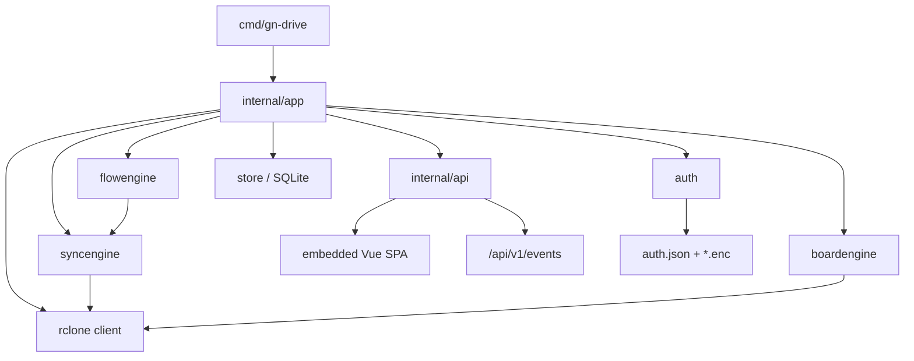

# Developer Guide

Contributor notes for GN Drive. User-facing install/usage stays in [README.md](./README.md). Architecture detail lives under [docs/](./docs/).

## Project map

```text
cmd/gn-drive/          CLI entry (cobra): run, service, sync, board, profile, remote, …
internal/
  app/                 Composition root (DI, portal data-plane open/close)
  api/                 chi HTTP API + SSE + session cookies
  auth/                Master password, encrypt/decrypt config
  store/               SQLite schema + repos
  rclone/              Shell-out wrapper around rclone CLI
  syncengine/          Task registry, profile schedules, WaitTask
  flowengine/          Sequential flow execution
  boardengine/         Board DAG topological execution
  eventbus/            In-process typed events → SSE
  service/             systemd / launchd / SCM + health writer
  selfupdate/          GitHub Releases self-update
  webui/               go:embed of built Vue dist
  config/, ports/, instance/, logging/, browser/
frontend/              Vue 3 SPA (source)
  src/pages/           Unlock, Workspace, Settings (+ legacy page stubs)
  src/stores/          Pinia: auth, flows, remotes, profiles, …
internal/webui/dist/   Embedded SPA (built artifact; do not hand-edit)
docs/                  Knowledge base (current state)
```

## Runtime shape



**Portal mode** (`gn-drive run`, not `--service`): process starts even when locked. SPA shows Unlock; after unlock/setup, `AfterUnlock` opens store + rclone and attaches engines.

**CLI one-shots** (`sync`, `profile`, `remote`, `board`, …): non-portal; require unlock via `--password` / unlocked plaintext config when a master password is set.

## Requirements

- Go **1.25+**
- **pnpm** 9+ (frontend)
- **rclone** on `PATH` for real sync
- Optional: [Task](https://taskfile.dev), [air](https://github.com/air-verse/air) for hot reload

## Setup

```bash
git clone https://github.com/gnasdev/gn-drive.git
cd gn-drive
task install
# or: go mod download && cd frontend && pnpm install
```

## Common commands

| Command | Purpose |
|---------|---------|
| `task dev` | Vite watch → `internal/webui/dist` + air restarts Go on port **53241** |
| `task build` | Production frontend embed + `bin/gn-drive` |
| `task test` | `go test -race ./…`, `vue-tsc`, e2e coverage |
| `task lint` | golangci-lint + frontend ESLint |
| `task doctor` | `go run ./cmd/gn-drive doctor` |
| `task clean` | Remove bin/ and dist artifacts |

Dev URL: `http://127.0.0.1:53241/` — unlock in the browser if prompted. No separate Vite dev server; Go serves the SPA.

Air binary: `go install github.com/cosmtrek/air@latest` (or air-verse/air). Port stays fixed so restarts do not change the URL (see `.air.toml`, `scripts/dev.sh`, `internal/ports`).

## Frontend notes

- **Product shell**: Unlock → Workspace (`/`) → Settings (`/settings`). Legacy multi-page routes redirect to `/`.
- **Domain**: Flow = unit of work; Operation = one source/target step; Remotes for path pickers. Profiles are CLI/API option bags, not workspace cards. Boards are not on the workspace surface.
- Types mirror Go JSON contracts in `frontend/src/api/types.ts`.
- i18n: `en` + `vi` under `frontend/src/i18n/locales/`.
- E2E: Puppeteer via `frontend/scripts/e2e-run.mjs` (`pnpm run test:e2e` / `test:e2e:coverage`).

See [frontend/SPEC.md](./frontend/SPEC.md).

## Backend notes

- **Port**: default `53241` on `127.0.0.1` only (`internal/ports.DefaultPort`).
- **Instance lock**: flock under config dir so only one portal process owns the data plane.
- **Auth session**: cookie `gn-drive-session` (HttpOnly, SameSite=Strict, MaxAge 1d). Public routes: `/api/v1/status`, `/api/v1/events`, `/api/v1/auth/*`.
- **SSE**: do not gzip `text/event-stream` (compress middleware excludes it).
- **Profile / flow actions (product surface)**: `push` \| `bi` \| `bi-resync`. Legacy `pull` normalizes to `push` on profiles/flows; CLI `sync pull` still works for one-shot.
- **SQLite schema** matches the former Wails desktop so existing `~/.config/gn-drive/` data loads without migration.

## Release

Tag `v*.*.*` runs `.github/workflows/release.yml`:

- Matrix: darwin/arm64, linux/amd64, windows/amd64
- Build Vue → copy to `internal/webui/dist` → `go build` with version ldflags
- Publish GitHub Release artifacts

Local parity: `task build` with `VERSION` / `COMMIT` env vars (see `Taskfile.yml` `LDFLAGS`).

## Docs

Knowledge base under `docs/` follows Open Knowledge Format (YAML frontmatter + markdown). Entry points:

- [docs/overview.md](./docs/overview.md)
- [docs/_index.md](./docs/_index.md)
- [docs/_sync.md](./docs/_sync.md)

When behavior changes, update the smallest set of docs and refresh `_sync.md`.

## Layout conventions

- Constructor DI only — no package-level service singletons in app wiring
- Prefer pure-Go dependencies (sqlite: modernc)
- English comments for non-obvious contracts and edge cases
- Tests next to packages (`*_test.go`); CLI coverage in `cmd/gn-drive/cmd_test.go`
