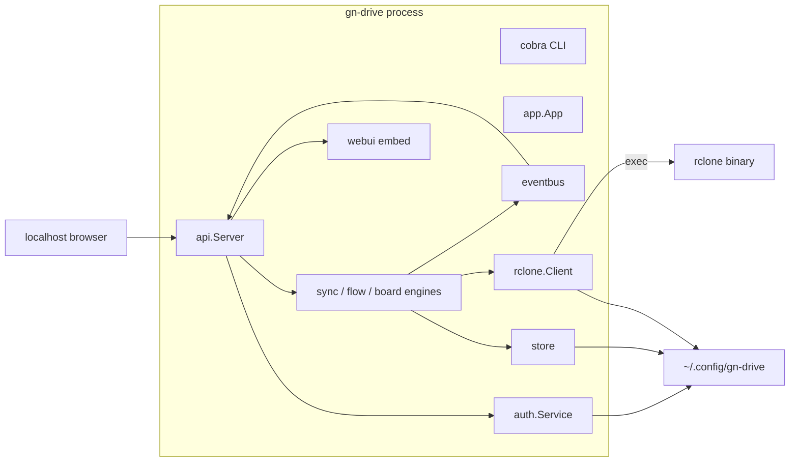

# Architecture Overview

## Style

Single binary, **constructor-based dependency injection** in `internal/app`. No package-level service singletons for core domains.

## Layers

1. **CLI** (`cmd/gn-drive`) — cobra subcommands; `run` owns lifecycle (port, lock, signals).
2. **App** (`internal/app`) — wires services; portal `AfterUnlock` / `BeforeLock` for deferred data plane.
3. **API** (`internal/api`) — chi router, auth middleware, REST, SSE, SPA fallback.
4. **Engines** — orchestration only; persistence via store; transfer via rclone.
5. **Adapters** — rclone shell-out, OS service managers, browser open, self-update.

## Portal data plane

| State | Store/rclone | Engines | UI |
|-------|--------------|---------|-----|
| Not set up | Open (plaintext) | Attached | Setup password optional |
| Unlocked | Open | Attached | Workspace |
| Locked + encrypted | Deferred | Present, detached | Unlock page |
| Locked + plaintext left on disk | Open | Attached | Unlock still required for session cookie |

`canOpenDataPlane` opens SQLite/rclone when setup is false, unlocked, or locked without `.enc` files.

## Networking

- Listen: `127.0.0.1:53241` by default (`ports.DefaultPort`)
- Port `0` is treated as default (no kernel random port)
- Hot reload retries bind briefly so air can rebind
- Instance flock prevents two portals on the same config dir

## Event path

Engines publish typed events on `eventbus.Bus`. API SSE (`GET /api/v1/events`) fans out JSON frames to the SPA for live flow/sync progress. Compress middleware skips `text/event-stream`.

## Persistence model

SQLite schema is compatible with the former Wails desktop app:

- `profiles`, `schedules`, `history`
- `boards`, `board_nodes`, `board_edges`
- `flows`, `operations`
- `settings`, `delta_state`

Primary web workflow uses **flows + operations**. Profiles remain for CLI one-shot and REST CRUD. Boards remain for CLI DAG execution.

## Frontend architecture

- Vue 3 + Pinia + vue-router + vue-i18n + Tailwind 4
- Built assets copied/embedded into `internal/webui/dist` (`//go:embed all:dist`)
- SPA history routes; unknown paths serve `index.html`
- Cookie credentials on all `fetch` calls

## Cross-cutting decisions

| Decision | Choice |
|----------|--------|
| Sync transport | Shell-out to rclone CLI, not library |
| SQLite driver | modernc pure Go (no CGo) |
| Auth KDF | Argon2id (64MiB, t=3, p=4) |
| Encryption | AES-256-GCM, 12-byte nonce prefix on `.enc` |
| Scheduling | `robfig/cron/v3` inside syncengine |
| Default UI unit | Flow (not Profile, not Board) |

## Related

- [Overview](/overview.md)
- [API module](/modules/api.md)
- [App module](/modules/app.md)
