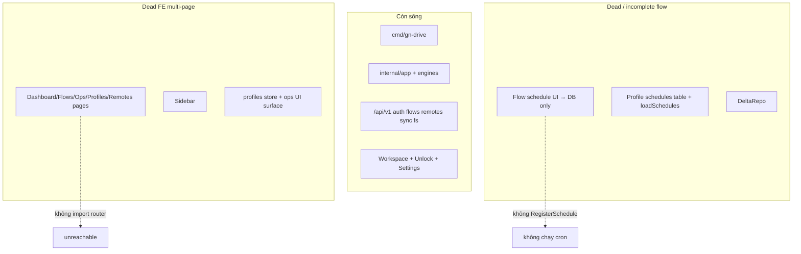

# Cleanup toàn bộ dự án GN Drive

## Bối Cảnh

Sau migration Wails → single-process CLI + Vue workspace, nhiều surface multi-page và phase stub còn sót. Knowledge base (`docs/`) vừa bootstrap; worktree có docs mới chưa commit.

Audit dựa trên: tree hiện tại, router/entrypoint, `rg` reachability, so khớp API ↔ FE ↔ e2e. **Chưa xóa code** — plan này chờ duyệt.

## Nguyên Nhân Và Lý Do Thiết Kế

| Nguyên nhân gốc | Triệu chứng |
|-----------------|-------------|
| UI gộp về Workspace nhưng không gỡ multi-page | Page/store/component/i18n/nav còn file, router chỉ redirect |
| Schema/API giữ tương thích Wails | Repo Delta, bảng `schedules`, field tray/login, stub logs |
| Feature schedule chuyển sang Flow nhưng cron engine chỉ load bảng `schedules` | UI bật cron trên flow → chỉ lưu DB, không fire |
| Tooling/docs theo phase cũ | Taskfile trỏ plan đã mất; lint script không có config; e2e testid profile-era |

## Góc Nhìn Tổng Quan Và Phạm Vi Tập Trung



**Trong phạm vi cleanup:** dead FE, stub rõ ràng, lockfile thừa, e2e stale, tooling hỏng, comment Phase, settings Wails-only.

**Ngoài phạm vi (giữ trừ khi product quyết định khác):** schema SQLite tương thích dữ liệu user; CLI board/profile/sync; boardengine; Profile REST cho CLI/tooling.

## Mục Tiêu

1. Xóa code FE không reachable từ router/App.
2. Thu gọn store/SSE còn cần cho Workspace (không phụ thuộc OperationsPage).
3. Làm rõ hoặc sửa **flow cron** (implement hoặc ẩn UI + document gap).
4. Cập nhật e2e + i18n + Taskfile/tooling cho khớp product surface.
5. Không phá data `~/.config/gn-drive/` và contract CLI công khai.

## Ngoài Phạm Vi

- Viết lại UI/theme.
- Xóa bảng boards/profiles/history/schedules khỏi SQLite (dữ liệu user + CLI).
- Self-update / release pipeline redesign.
- Implement full delta watcher (Phase 6) — chỉ quyết định giữ stub hay cắt repo dead.

## Logic Nghiệp Vụ (sau cleanup)

- Entrypoint web: Unlock → Workspace (remotes + flows) → Settings.
- Chạy sync: flow execute (tuần tự ops) + CLI `sync`/`board`/`profile`.
- Cron: **cần quyết định product** — hoặc wire flow → cron engine, hoặc không expose schedule cho đến khi wire xong.
- Profile/Board: CLI + store; không UI workspace.

## Inventory Có Bằng Chứng

### A. Dead code FE — đủ bằng chứng xóa (P0)

| Candidate | Bằng chứng |
|-----------|------------|
| `pages/DashboardPage.vue` | Không import; router không lazy-load |
| `pages/FlowsPage.vue` | Idem |
| `pages/OperationsPage.vue` | Idem |
| `pages/ProfilesPage.vue` | Idem |
| `pages/RemotesPage.vue` | Idem (workspace có remotes strip) |
| `components/layout/Sidebar.vue` | Không import; App chỉ dùng Topbar |
| `components/ui/EmptyState.vue` | Chỉ dead pages |
| `components/ui/SectionLoading.vue` | Chỉ dead pages |
| `components/ui/SkeletonCard.vue` | Chỉ DashboardPage |
| `components/forms/DirectionField.vue` | Chỉ ProfilesPage |
| `lib/profileValidation.ts` | Chỉ ProfilesPage |
| `stores/profiles.ts` | Chỉ ProfilesPage |
| `composables/useSwrCache.ts` | Chỉ DashboardPage |
| `composables/useOptimisticList.ts` | **Zero callers** |
| `frontend/bun.lock` | Repo dùng pnpm (`pnpm-lock.yaml`, Taskfile) |

**~1.2k LOC** page/layout/store liên quan multi-page.

### B. Dead / partial FE — cần thu gọn, không xóa hết (P0–P1)

| Candidate | Ghi chú |
|-----------|---------|
| `stores/operations.ts` | `useEventStream` gọi `ops.applySyncEvent`; Workspace **không** đọc `tasks`/`profiles` từ store này — surface UI đã chết. Có thể gỡ `loadProfiles`/`startSync`/list UI API hoặc gộp progress vào `flows` only |
| `i18n` keys `nav.dashboard/profiles/…`, blocks `dashboard`/`profiles`/`operations`/`flows` (page-level) | Phần lớn chỉ phục vụ multi-page; giữ keys `workspace.*` / `settings.*` / `unlock.*` |
| Router redirects `/profiles`… | **Giữ** redirect để bookmark cũ không 404 |

### C. Dead / incomplete backend flows (P1 — product decision)

| Candidate | Bằng chứng | Rủi ro nếu xóa |
|-----------|------------|----------------|
| **Flow cron không fire** | UI + FlowRepo lưu `schedule_enabled`/`cron_expr`; `syncengine.loadSchedules` chỉ đọc bảng `schedules` (profile). Không có bridge flow→RegisterSchedule | User nghĩ schedule chạy — **bug/gap**, không chỉ dead code |
| Bảng `schedules` + ScheduleRepo | Engine load + tests; **không** HTTP/UI tạo schedule mới | Giữ schema; có thể data Wails cũ vẫn fire |
| `DeltaRepo` + `delta_state` | Chỉ `store_test`; comment “Phase 6 deferred” | Xóa repo = migration schema? **Không drop table** trừ khi chắc |
| `GET /sync/tasks/{id}/logs` | Handler trả `[]` cố định | Client không gọi; stub hoặc xóa route |
| `POST /operations` (copy/move/…) | API + tests; FE không gọi | Hữu ích tooling; giữ hoặc document API-only |
| `Settings` keys `minimize_to_tray`, `start_at_login`, `notifications_enabled` | API đọc/ghi; SettingsPage **không** bind (theme local Pinia) | Giữ store keys harmless; có thể bỏ load vô nghĩa ở FE |
| `Profile.StripEncryptPasswords` | No-op + tests only | Xóa method hoặc implement — quyết định crypt |
| `api/exec.go` `ownExe` | Định nghĩa, **không** call site | Xóa file/var an toàn nếu confirm |
| `logging.WithContext` no-op | Chỉ wrapper | Giữ hoặc implement trace — low priority |
| Comment package “Phase 1/2/3 stubs” | `main.go`, `webui.go`, … | Cập nhật comment cho current-state |

### D. Legacy intentional — **không xóa** trong cleanup mặc định

| Surface | Lý do |
|---------|--------|
| CLI `board` + `boardengine` + BoardRepo | Entry CLI + tests; docs module đã mô tả |
| CLI/API profiles + ProfileRepo | One-shot sync |
| HistoryRepo | `syncengine` ghi history; doctor đọc |
| Dual JSON aliases (`enabled`/`schedule_enabled`) | FE cũ/compat |
| Wails-aligned event field names | FlowRunStatusPanel |

### E. Tooling / e2e / docs drift (P0–P1)

| Candidate | Bằng chứng |
|-----------|------------|
| `frontend/e2e/specs/full-journey.spec.ts` | Còn `profiles-add`, `workspace-operations`, `profile-row-*`, `flows-add-form` — **không** match testid Workspace hiện tại |
| `Taskfile.yml` comment → `docs/specs/planning/refactor-gn-drive-web-stack.md` | File **không tồn tại** |
| `task lint` | `golangci-lint` + `eslint` nhưng **không** có `.golangci*` / eslint config trong repo |
| `package.json` script `lint` | Sẽ fail nếu chạy |
| `.go-version` `1.26.3` vs `go.mod` / CI `1.25.0` | Lệch toolchain |
| `config.isDevEnv` heuristic `desktop/bin` | Wails path; low risk giữ |
| Docs | Đã khớp product; sau cleanup cần touch `_sync` + note flow-cron gap nếu chưa fix |

## Hướng Tiếp Cận Đề Xuất

Làm **theo phase**, mỗi phase có validation riêng. Ưu tiên xóa FE dead trước (blast radius nhỏ), rồi e2e/tooling, rồi quyết định flow-cron / delta.

### Phase 0 — Chốt product (trước khi đụng backend schedule)

Chọn **một**:

1. **Wire flow cron:** khi save/list flow có `schedule_enabled`, đăng ký job gọi `FlowEngine.Execute` (hoặc syncengine wrapper); unregister khi disable/delete.
2. **Thu hẹp surface:** ẩn/disable schedule UI + document “not scheduled yet”; giữ field DB.
3. **Hybrid:** giữ UI nhưng badge “saved, scheduling pending” — không khuyến nghị lâu dài.

**Khuyến nghị:** (1) nếu schedule là selling point workspace; (2) nếu muốn cleanup nhanh và tránh false promise.

### Phase 1 — Dead FE multi-page (an toàn)

1. Xóa 5 page stubs + Sidebar + UI-only helpers (EmptyState, SectionLoading, SkeletonCard, DirectionField, profileValidation, profiles store, useSwrCache, useOptimisticList).
2. Xóa `frontend/bun.lock`.
3. Thu gọn `operations` store:
   - Option A: xóa store; `useEventStream` chỉ gọi `flows.applySyncProgress`.
   - Option B: giữ store tối thiểu nếu còn cần cache task list cho tương lai — **không khuyến nghị** nếu không có UI.
4. Dọn i18n en/vi: xóa block nav/page dead; giữ workspace/settings/common/errors.
5. Giữ router redirects legacy.

### Phase 2 — E2E + tooling

1. Viết lại journey e2e theo Workspace: remotes-add → flows-add → add op → run → settings/lock.
2. Sửa Taskfile comment (trỏ docs hiện tại hoặc bỏ path plan cũ).
3. Align Go version: `.go-version` ↔ `go.mod` ↔ CI.
4. Lint: hoặc thêm config tối thiểu, hoặc đổi `task lint` / `pnpm lint` thành lệnh thực sự chạy được (`vue-tsc` + `go vet`/`staticcheck`).

### Phase 3 — Backend stubs (sau Phase 0)

Tùy quyết định:

| Nếu | Việc |
|-----|------|
| Wire flow cron | Implement register/unregister; tests cron fire Execute |
| Không schedule | Optional: ẩn API field docs; không xóa cột |
| Delta unused | Giữ table; optional mark `DeltaRepo` deprecated trong docs; **không** drop DDL |
| Task logs | Xóa route stub **hoặc** implement ring buffer — không để “Not implemented Phase 3” |
| `ownExe` | Xóa nếu vẫn zero refs |
| Settings tray/login | Bỏ keys khỏi GET list **hoặc** document legacy no-op |

### Phase 4 — Docs hygiene

1. Cập nhật docs nếu behavior schedule đổi.
2. Ghi gap đã đóng trong `_sync.md`.
3. Comment package bỏ “Phase 1 stubs” / “placeholder HTML”.

## Chi Tiết Triển Khai (Phase 1 gợi ý file)

**Xóa:**

```text
frontend/src/pages/DashboardPage.vue
frontend/src/pages/FlowsPage.vue
frontend/src/pages/OperationsPage.vue
frontend/src/pages/ProfilesPage.vue
frontend/src/pages/RemotesPage.vue
frontend/src/components/layout/Sidebar.vue
frontend/src/components/ui/EmptyState.vue
frontend/src/components/ui/SectionLoading.vue
frontend/src/components/ui/SkeletonCard.vue
frontend/src/components/forms/DirectionField.vue
frontend/src/lib/profileValidation.ts
frontend/src/stores/profiles.ts
frontend/src/composables/useSwrCache.ts
frontend/src/composables/useOptimisticList.ts
frontend/bun.lock
```

**Sửa:**

```text
frontend/src/composables/useEventStream.ts   # bỏ ops store
frontend/src/stores/operations.ts            # xóa file nếu Option A
frontend/src/i18n/locales/en.ts, vi.ts
frontend/e2e/specs/full-journey.spec.ts
Taskfile.yml
.go-version (hoặc go.mod)
```

## Công Việc Cần Làm

- [ ] **Duyệt Phase 0:** wire flow cron vs ẩn schedule
- [ ] Phase 1: xóa dead FE + bun.lock + thu gọn event stream
- [ ] Phase 2: e2e workspace + fix lint/task/go version
- [ ] Phase 3: stubs backend theo quyết định Phase 0
- [ ] Phase 4: docs + comment current-state
- [ ] Validation (bên dưới)

## Rủi Ro Và Ràng Buộc

| Rủi ro | Mitigation |
|--------|------------|
| Xóa page còn được import động | Router đã kiểm tra; sau xóa chạy `vue-tsc` + e2e |
| E2E coverage gate fail | Cập nhật test cùng PR Phase 1–2 |
| User data schedule/board | Không drop bảng/cột |
| CLI board/profile regression | Không đụng `cmd/` trừ comment; chạy `go test ./...` |
| `operations` store còn side-effect | Đọc kỹ `applySyncEvent` trước khi xóa — progress flow đi qua `flows.applySyncProgress` |

## Phần Cần Xác Minh Thêm (không đủ bằng chứng xóa ngay)

- `POST /operations` có client ngoài repo không? → giữ API-only trừ khi product bỏ file ops.
- Bảng `schedules` có dữ liệu user production từ Wails không? → không xóa repo; có thể chỉ document.
- `History` UI: hiện không có page history — doctor + DB only; **không** xóa HistoryRepo.
- `vite-plugin-pwa` / service worker trong dist: có intentional không? (ngoài cleanup dead code trừ khi SW gây bug).

## Kiểm Chứng

Sau mỗi phase:

```bash
# Backend
go test -race ./...

# Frontend
cd frontend && pnpm run type-check
cd frontend && pnpm run test:e2e   # sau khi sửa e2e

# Optional full
task test
task build
```

Checklist thủ công:

- [ ] `gn-drive run` → unlock → workspace remotes/flows run/stop
- [ ] Settings theme/lang/password/lock
- [ ] `gn-drive sync push --profile …`, `profile list`, `board …`, `doctor`
- [ ] Không còn import broken sau xóa page

## Tóm Tắt Cho Reviewer

Cleanup chính là **gỡ xác multi-page FE** + **sửa e2e/tooling** + **chốt gap flow cron** (bug chức năng, không chỉ dead code). Backend schema/CLI giữ tương thích. Delta/task-logs/settings tray là stub thứ cấp.

**Chờ duyệt** trước khi sửa source. Khi duyệt, nêu rõ lựa chọn Phase 0 (wire cron / ẩn schedule) và có cho phép Phase 1 xóa FE ngay không.
